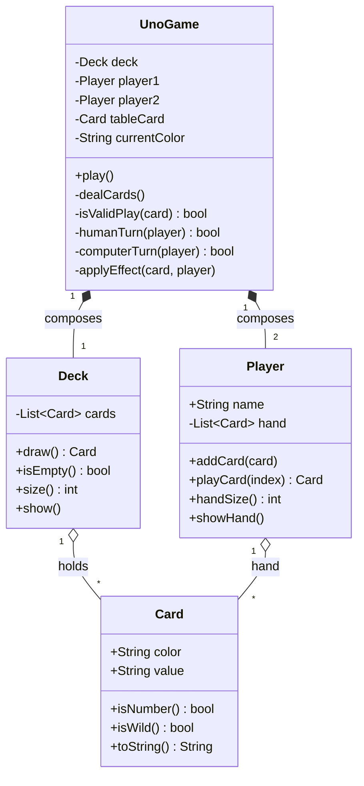

# UNO Game — Java & Python (OOP)

Console implementation of the classic **UNO** card game, built for the
**Object-Oriented Programming** course across two midterms:

- **1st midterm — Java:** the original object-oriented implementation.
- **2nd midterm — Python:** the same game migrated to Python, **plus a new
  save/resume feature**.

This repository keeps **both versions side by side** so the evolution from Java
to Python can be followed end to end.

## Team

- Aaron Lopez
- Damian Vargas
- Francisco Quezada

**Course:** Object-Oriented Programming

## Repository layout

```
.
├── README.md
├── .gitignore
├── java-version/       # 1st midterm — Java (no save feature)
│   ├── README.md
│   └── src/uno/
│       ├── Main.java
│       ├── models/{Card,Deck,Player}.java
│       └── game/UnoGame.java
└── python-version/     # 2nd midterm — Python (adds save/resume)
    ├── README.md
    ├── run.py
    ├── docs/STRUCTURE.md
    └── src/uno/
        ├── main.py
        ├── models/{card,deck,player}.py
        ├── game/uno_game.py
        └── persistence/storage.py
```

## The two versions

| Version  | Midterm | Language | Save/resume        |
|----------|---------|----------|--------------------|
| Java     | 1st     | Java 17+ | No                 |
| Python   | 2nd     | Python 3.10+ | Yes (`pickle`) |

Both share the **same object-oriented design** (`Card`, `Deck`, `Player`,
`UnoGame`) and the same rules. The Python version adds a `persistence` module
that serializes the game after each turn, so a game can be continued later.

## Run

### Java version (1st midterm)

```bash
cd java-version
javac -d out src/uno/Main.java src/uno/models/*.java src/uno/game/*.java
java -cp out uno.Main
```

### Python version (2nd midterm)

```bash
cd python-version
python run.py
```

## How to play

- You play against the **computer**. Each player starts with **7 cards**.
- On your turn your hand is shown numbered; type the **index** of the card you
  want to play.
- A card is valid if it **matches the color or the number/symbol** of the card
  on the table.
- If you have no valid play, you draw a card and lose your turn.
- The first player to run **out of cards** wins.

### Cards

| Symbol  | Meaning                |
|---------|------------------------|
| `0`-`9` | Number card            |
| `^`     | Skip turn              |
| `&`     | Reverse                |
| `%`     | Color change           |
| `+2`    | Opponent draws 2       |
| `+4`    | Opponent draws 4       |

Colors: **R** (red), **Y** (yellow), **G** (green), **B** (blue), **W** (black/wild).

## Class diagram (UML)

The design is identical in both languages.



> GitHub renders this diagram automatically when viewing the README.

## From Java to Python

These are the main differences applied during the migration (2nd midterm):

| Concept                  | Java                                    | Python                                  |
|--------------------------|-----------------------------------------|-----------------------------------------|
| Class definition         | `public class Card { ... }`             | `class Card:`                           |
| Fields + getters/setters | Private fields + `getX()` methods       | Direct attributes / `@dataclass`        |
| Constructor              | `public Card(String color) { ... }`     | `def __init__(self, color):`            |
| Typing                   | Static and mandatory (`String color`)   | Dynamic, with optional type hints       |
| Lists                    | `ArrayList<Card>`                       | `list[Card]`                            |
| Instance reference       | `this`                                  | `self` (explicit in every method)       |
| Console input            | `Scanner.nextLine()`                    | `input()`                               |
| Serialization (saving)   | (not implemented in 1st midterm)        | `pickle` module                         |
| Entry point              | `public static void main(String[])`     | `if __name__ == "__main__":`            |
| Printing                 | `System.out.println(...)`               | `print(...)`                            |

**The feature added in the Python version** was **saving and resuming a game**
(`python-version/src/uno/persistence/storage.py`), implemented with `pickle`.

## OOP concepts applied

- **Encapsulation:** each class manages its own state (the `Player`'s hand, the
  `Deck`'s cards).
- **Abstraction:** `Card`, `Deck` and `Player` model real game entities with
  clear methods.
- **Composition:** `UnoGame` is composed of one `Deck` and two `Player` objects.
- **Separation of concerns:** models, game logic and (in Python) persistence
  live in separate packages.
