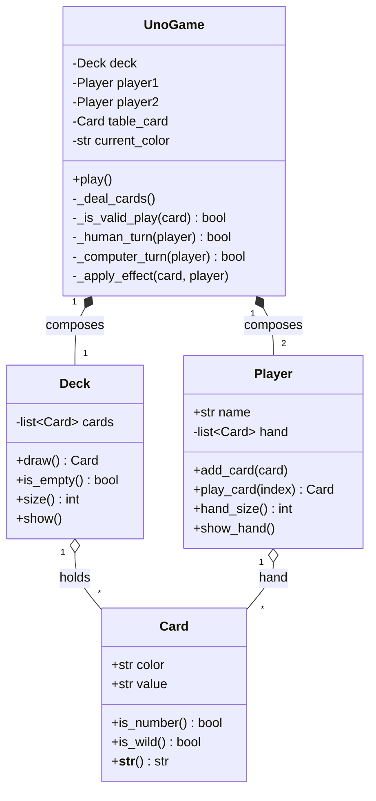

# UNO Game in Python (OOP)

Console implementation of the classic **UNO** card game, developed as the
**2nd midterm project for the Object-Oriented Programming course**. The code was
migrated from Java to Python and extended with the ability to **save and resume
a game** through serialization.

## Team

- Aaron Lopez
- Damian Vargas
- Francisco Quezada

**Course:** Object-Oriented Programming

## Run

Requires **Python 3.10 or higher** (no external dependencies, only the standard
library).

```bash
python run.py
```

## How to play

- You play against the **computer**. Each player starts with **7 cards**.
- On your turn your hand is shown numbered; type the **index** of the card you
  want to play.
- A card is valid if it **matches the color or the number/symbol** of the card
  on the table.
- If you have no valid play, you draw a card and lose your turn.
- The first player to run **out of cards** wins.

### Cards

| Symbol  | Meaning                |
|---------|------------------------|
| `0`-`9` | Number card            |
| `^`     | Skip turn              |
| `&`     | Reverse                |
| `%`     | Color change           |
| `+2`    | Opponent draws 2       |
| `+4`    | Opponent draws 4       |

Colors: **R** (red), **Y** (yellow), **G** (green), **B** (blue), **W** (black/wild).

## Saving the game

The game is saved **automatically** after every turn to a `savegame.dat` file
using the `pickle` module. When the game starts, if a saved game exists, you are
offered to resume it. When the game ends, the file is deleted automatically.

## Project structure

```
.
├── run.py                  # Entry point (python run.py)
├── README.md
├── .gitignore
├── docs/
│   └── STRUCTURE.md        # Object-oriented design explanation
└── src/
    └── uno/
        ├── main.py         # Start menu: new game or resume
        ├── models/         # Domain entities
        │   ├── card.py
        │   ├── deck.py
        │   └── player.py
        ├── game/           # Game logic and rules
        │   └── uno_game.py
        └── persistence/    # Game saving and loading
            └── storage.py
```

## OOP concepts applied

- **Encapsulation:** each class manages its own state (the `Player`'s hand, the
  `Deck`'s cards).
- **Abstraction:** `Card`, `Deck` and `Player` model real game entities with
  clear methods.
- **Composition:** `UnoGame` is composed of one `Deck` and two `Player` objects.
- **Separation of concerns:** models, game logic and persistence live in
  separate packages.

## Class diagram (UML)



> GitHub renders this diagram automatically when viewing the README.

## From Java to Python

This project was migrated from an original **Java** implementation. These are
the main differences applied during the conversion:

| Concept                 | Java                                    | Python (this project)                   |
|-------------------------|-----------------------------------------|-----------------------------------------|
| Class definition        | `public class Card { ... }`             | `class Card:`                           |
| Fields + getters/setters | Private fields + `getX()` methods      | Direct attributes / `@dataclass`        |
| Constructor             | `public Card(String color) { ... }`     | `def __init__(self, color):`            |
| Typing                  | Static and mandatory (`String color`)   | Dynamic, with optional type hints       |
| Lists                   | `ArrayList<Card>`                       | `list[Card]`                            |
| Instance reference      | `this`                                  | `self` (explicit in every method)       |
| Serialization (saving)  | `Serializable` + `ObjectOutputStream`   | `pickle` module                         |
| Entry point             | `public static void main(String[])`     | `if __name__ == "__main__":`            |
| Printing                | `System.out.println(...)`               | `print(...)`                            |

**The added feature** over the original was **saving and resuming a game**
(`src/uno/persistence/storage.py`), which in Java would use `Serializable` and
in Python was solved with `pickle`.
